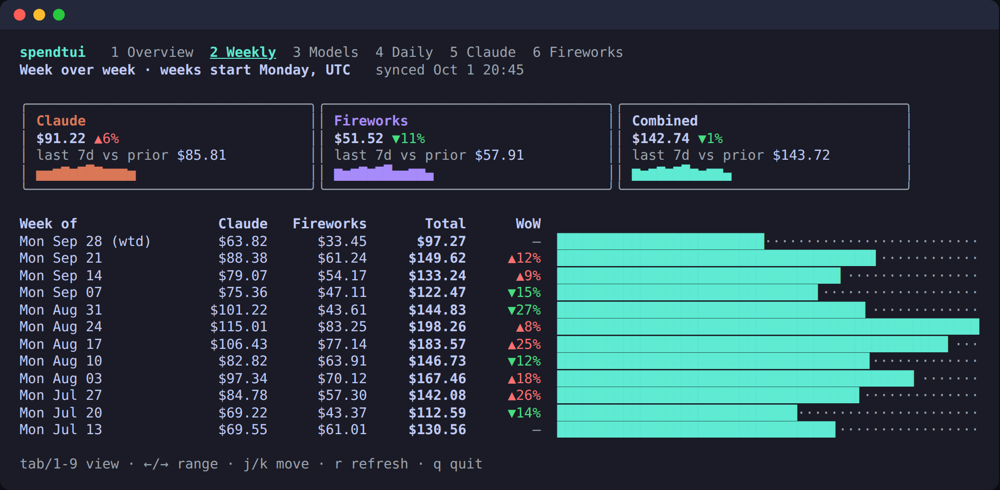
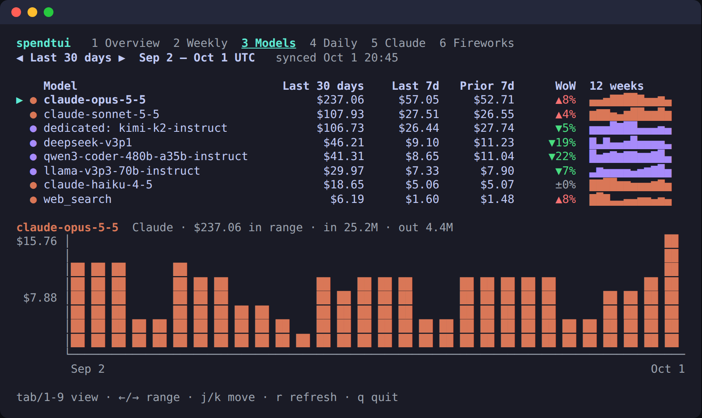
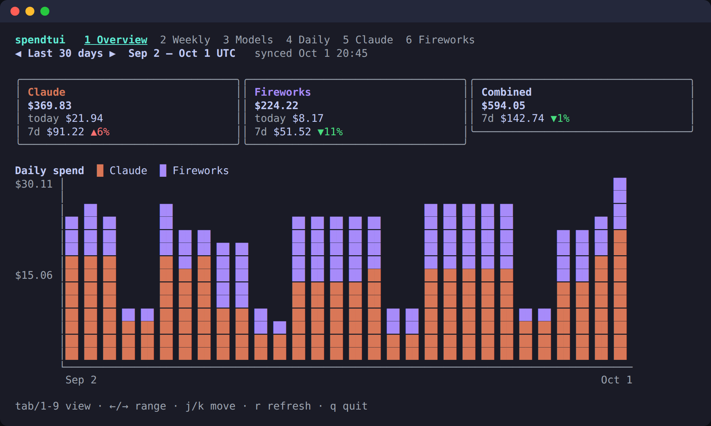

# spendtui

A terminal dashboard for your **Claude API** and **Fireworks AI** spend, built
with [Bubble Tea](https://github.com/charmbracelet/bubbletea).

History is kept in a local [DuckDB](https://duckdb.org) file, so it opens
instantly from cache, keeps working offline, and you can query it yourself.





<sub>Screenshots use `--demo` data.</sub>

## Views

| Key | View | What it shows |
|---|---|---|
| `1` | Overview | One card per provider (total, today, month-end projection, 7-day change, budget bar) and a combined card, over a stacked daily column chart |
| `2` | Weekly | Week over week: last 7 days vs the 7 before for each provider, a 12-week sparkline, and a table of calendar weeks (Monday start) with the change from the week before |
| `3` | Models | Every model from both providers, sorted by spend in the selected range, with last 7d / prior 7d / change and a 12-week sparkline. `j`/`k` move the cursor; the selected model's daily chart and token totals show underneath |
| `4` | Daily | Day-by-day table, newest first, with per-provider columns and a total bar |
| `5` | Claude | Daily chart, plus a per-model breakdown with spend, share and token counts |
| `6` | Fireworks | The same, per model / dedicated deployment / training job |

Other keys: `←`/`→` (or `h`/`l`) cycle the range (Month to date, Last 7 days,
Last 30 days, Last month, Last 90 days), `j`/`k` scroll or move, `r` refresh,
`q` quit.

Week-over-week changes are colored by what they mean for your bill: red ▲ when
spend went up, green ▼ when it went down. The current week is marked `(wtd)`
and isn't compared, since a partial week against a full one would always look
like a drop.

All dates are UTC days, which is how both providers bucket billing.

## Install

```fish
go install github.com/sam-phinizy/sams-claude-menagerie/spendtui@latest
```

DuckDB is linked in through cgo, so you need a C compiler (Xcode command line
tools on macOS, `gcc` on Linux). Prebuilt DuckDB libraries ship for
macOS and Linux on amd64/arm64, and the first build takes a minute.

or from a checkout: `cd spendtui; go build .`

Try it without keys: `spendtui --demo`

## Configure

```fish
# Claude: needs an *Admin* API key (Console → Settings → Admin keys).
# Regular sk-ant-api keys are rejected by the cost endpoint.
set -Ux ANTHROPIC_ADMIN_KEY sk-ant-admin01-...

# Fireworks: an API key plus your account id (`firectl whoami` shows it).
set -Ux FIREWORKS_API_KEY fw_...
set -Ux FIREWORKS_ACCOUNT_ID my-account

# Optional monthly budgets in USD; they drive the budget bars on the overview.
set -Ux SPENDTUI_CLAUDE_BUDGET 400
set -Ux SPENDTUI_FIREWORKS_BUDGET 250
```

Configure either provider or both; whichever has credentials shows up.

Flags: `--claude-budget`, `--fireworks-budget` (override the env vars),
`--refresh 5m` (auto-refresh interval; `0` disables), `--range 1-5` (initial
range), `--db PATH`, `--backfill-days 180`, `--demo`.

`--snapshot VIEW` prints a single frame and exits instead of opening the TUI
(`--width`/`--height` set its size; `COLORTERM=truecolor` keeps full color when
piping). Handy for a status script, or for the screenshots above.

## Storage

Spend lives in `~/.local/share/spendtui/spend.duckdb` (or under
`$XDG_DATA_HOME`; override with `--db`). One table:

```sql
spend(provider, day DATE, model, usd DOUBLE, input_tokens, output_tokens, fetched_at)
-- primary key (provider, day, model)
```

- **First run** backfills `--backfill-days` (default 180) per provider.
- **Every refresh after that** refetches only from 7 days before the newest
  stored day, and replaces that window. Both providers revise recent days, and a
  model can drop out of a revised day, so the window is replaced rather than
  upserted.
- **On launch** the TUI shows what's stored right away, then syncs in the
  background. If a sync fails you keep the stored numbers, with the error shown
  on the card.
- `--demo` uses an in-memory database, so demo rows never touch your file.

DuckDB allows a single writer process, so a second spendtui pointed at the
same file will fail to open it. Query it while spendtui isn't running:

```fish
duckdb ~/.local/share/spendtui/spend.duckdb "
  SELECT provider, model, date_trunc('week', day) AS week, round(sum(usd), 2) AS usd
  FROM spend GROUP BY ALL ORDER BY week DESC, usd DESC LIMIT 20"
```

## Where the numbers come from

| Provider | Endpoint | Notes |
|---|---|---|
| Claude | `GET /v1/organizations/cost_report` (Anthropic Admin API) | Daily buckets grouped by `description`, so each line carries its model. Amounts are USD cents. Web search and code execution show up as their own rows. Priority Tier costs are **not** included in this endpoint. The Admin API isn't available to individual (non-organization) accounts. |
| Fireworks | `GET /v1/accounts/{account}/billingUsage` | Daily buckets across `serverlessCosts`, `dedicatedCosts` and `trainingCosts`; cost is `costNanoUsd`. Windows are capped at 31 days, so longer ranges are fetched in chunks. Fireworks reports `0` cost when a line has no authoritative rate yet, which doesn't mean it was free. |

Switching ranges or views never refetches; everything is computed from the
stored history. Both APIs lag real usage by a few minutes.

The month-end projection is month-to-date spend ÷ days elapsed (today counts
as a full day) × days in the month. It only appears on the Month to date range.

## Layout

```
main.go                     flags, env, provider wiring, --snapshot
internal/spend              provider-neutral Line type, ranges, daily/weekly
                            rollups, week-over-week, projection
internal/anthropic          Admin API cost_report client
internal/fireworks          billingUsage client
internal/store              DuckDB persistence and incremental sync
internal/demo               deterministic fake providers for --demo
internal/ui                 Bubble Tea model, views, charts, sparklines
```

Adding another provider means implementing `spend.Provider`
(`Name()` + `Fetch(ctx, start, end) ([]spend.Line, error)`) and appending it
in `main.go`.
